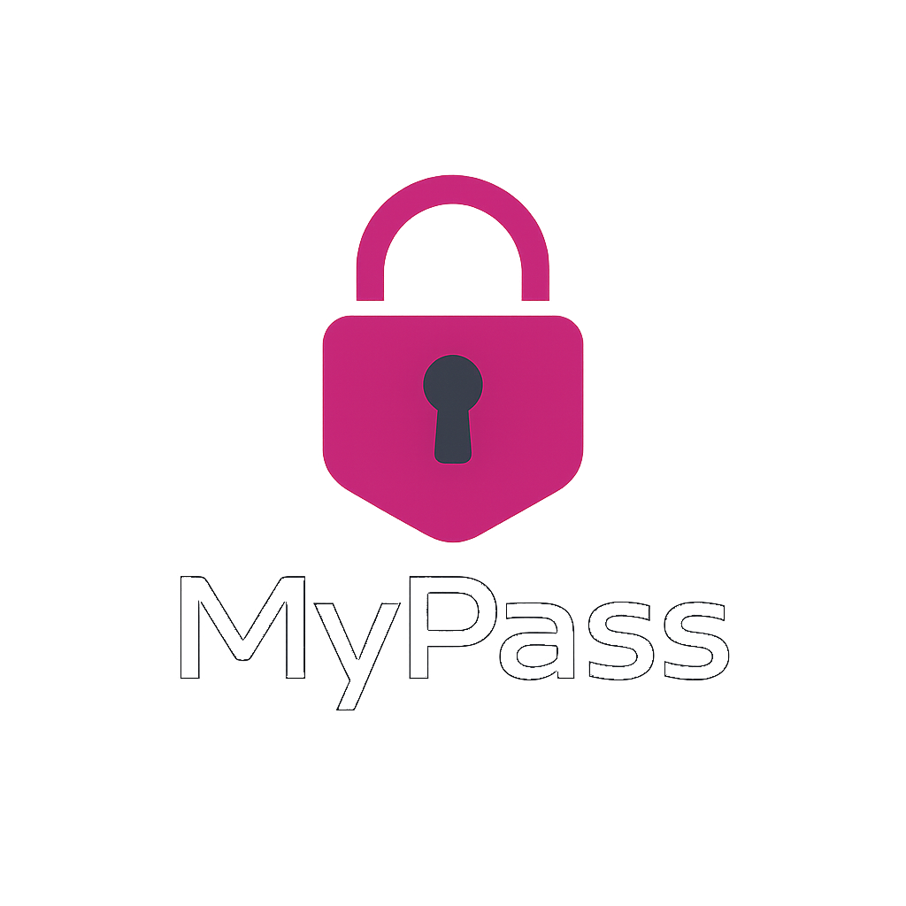

# MyPass 🔐

A sleek, modern password manager built with Python and [customtkinter](https://github.com/TomSchimansky/CustomTkinter).  
MyPass lets you generate, save, and search passwords locally.



---

## ✨ Features

- Modern dark-themed interface using CustomTkinter
- Strong password generator
- Local password storage in JSON

---

## 🧪 Requirements

- `Python 3.8+`
- `customtkinter`
- `pillow`
- `pyperclip`

Install dependencies:

```bash
pip install -r requirements.txt
```

## 🚀 Usage

Run the app:

python main.py

## 📁 File Structure

MyPass/
├── main.py
├── logo.png
├── themes/
│   └── magenta.json
├── password_characters.py
├── password.json         # auto-created on save
└── requirements.txt

## 📌 Notes

    Passwords are saved in plain JSON format (password.json)

    For improved security, consider adding encryption using the cryptography library

## 🧠 Future Plans

    Master password system

    Encrypted local vault

    Category/tag support

    Light/dark mode toggle

    Theme support
